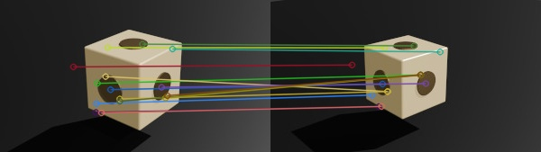

# Introduction :

Cette application permet de charger deux images, d'en extraire les points clés, 
puis d'associer entre eux les points clés qui représentent le même lieu dans les deux images.

# Utilisation :

* cloner ce dépôt dans un répertoire sur votre machine
* exécuter VSCode dans ce répertoire
* installer un environnement virtuel python
* installer les dépendances du projet en exécutant la commande :
```shell
pip install -r requirements
```
* déboguer ou exécuter le programme

# Détails :

Le fichier [`notes.txt`](./notes.txt) contient les différentes valeurs de paramètres pour l'algorithme
SIFT de recherche de points clés et pour l'algorithme FLANN Matcher permettant d'associer les points clés des deux images.

# résultat :




<sub>28 mai 2025</sub>